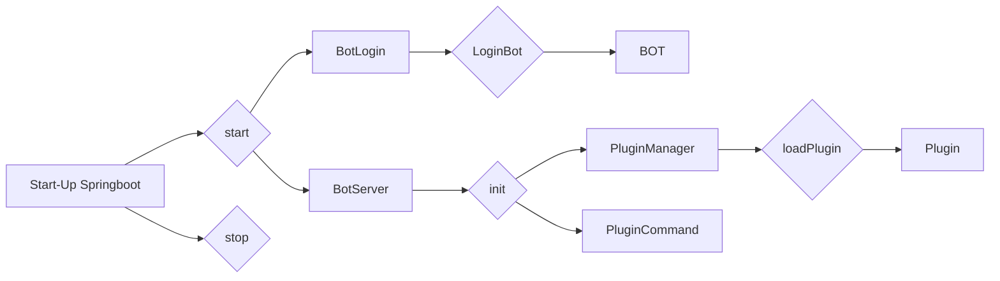

# XiaoYingBot
A little testability framework. This is my pratice framework, I wanna get more program thinking.

I use for reference to Bukkit(Minecraft plugin framework), so this framework look like Bukkit.

This framework's working principle:

